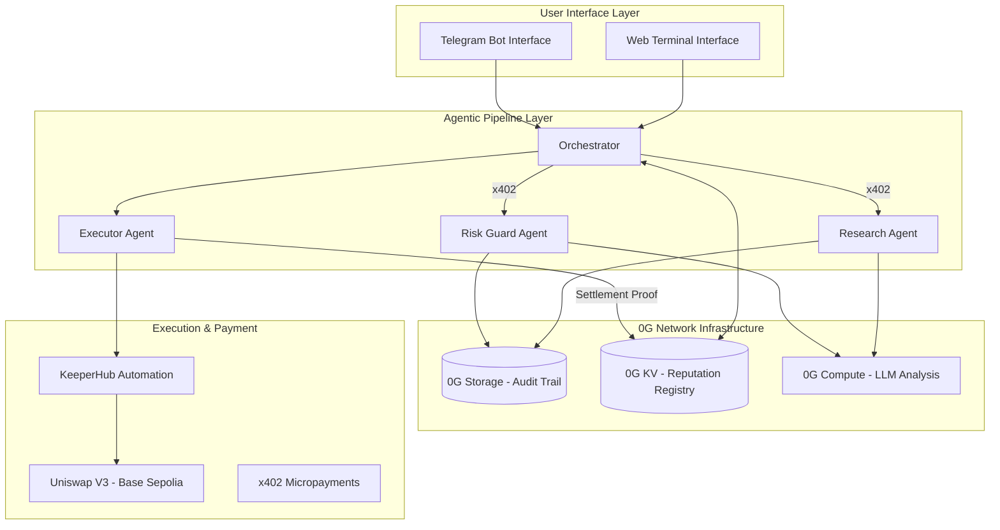
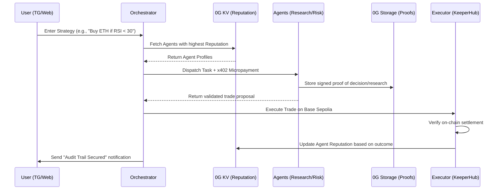

# 🏗️ Axiom-Fi: Technical Architecture & Workflow

This document outlines the high-level architecture and the step-by-step operational flow of the Axiom-Fi autonomous trading terminal.

---

## 1. System Architecture

The Axiom-Fi system is built on a modular, decentralized stack that separates the user interface, agentic intelligence, and infrastructure layers.

### Architectural Components:
- **Web Terminal:** A premium dashboard for real-time monitoring of the agent audit trail.
- **Telegram Bot:** The primary interface for users to register wallets and trigger strategies.
- **Agent Pipeline:** Specialized TypeScript agents that research, validate risk, and execute trades.
- **0G Storage:** Stores the "Proof of Decision" and logs for every trade, ensuring total transparency.
- **0G KV:** Acts as the decentralized state store for user settings and the "Agent Reputation Registry."
- **0G Compute:** Powers the LLM-driven research and risk analysis logic.
- **x402 Protocol:** Facilitates trustless, performance-indexed micropayments between agents.

---

## 2. Working Workflow (Sequence)

The following sequence diagram illustrates the lifecycle of a single trade strategy, from input to on-chain settlement and reputation update.

### The 5 Steps of Intelligence:
1. **Input:** The strategy is parsed by the Orchestrator.
2. **Selection:** Agents are chosen based on their verifiable on-chain history (Reputation).
3. **Attestation:** Agents provide research and risk checks, anchoring their proofs to 0G Storage.
4. **Execution:** Trades are settled on-chain via KeeperHub and Uniswap.
5. **Accountability:** Reputation scores are updated based on the actual PnL of the trade.

---

## 3. The "No-Mock" Infrastructure

Axiom-Fi follows a strict **No-Mock Policy**. Every component in this architecture interacts with live network nodes:
- **Storage:** All uploads go to the live 0G Storage Testnet.
- **KV:** All reputation state is stored in 0G KV via on-chain flow contracts.
- **Settlement:** All transactions are executed on the Base Sepolia network.
