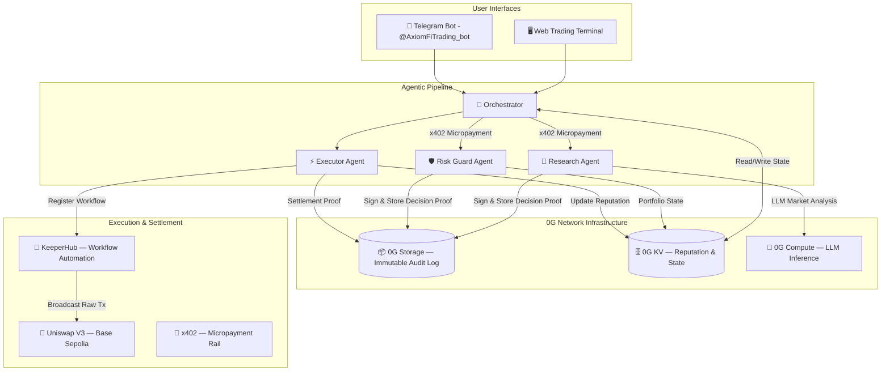
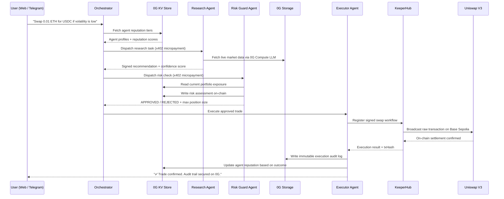

# 🪐 Axiom-Fi: The Autonomous Agentic Trading Terminal

> ### *"Finally, trading tools that have something to lose."*

<p align="center">
  <strong>Decentralized Agentic Intelligence · Powered by 0G Network · Settled on Base · Automated by KeeperHub</strong>
</p>

<p align="center">
  
  
  
  
  
</p>

---

## 🗺️ System Architecture



---

## 🔄 Operational Lifecycle



---

## 🔥 The Problem: DeFi's Accountability Crisis

The promise of decentralized finance was radical transparency. The reality for anyone who has used a trading bot or paid for a signal service is something far darker.

### 💀 Pain Points Destroying Trader Trust Today

**1. The Black Box Problem**
When an automated tool makes a trade with your capital, you see the result — not the reasoning. Did the bot trade on a momentum signal, a fabricated backtest, or a rugpull? You will never know. There is no on-chain record of *why* a decision was made.

**2. Fabricated Performance Records**
The $3 billion signal-bot industry runs almost entirely on cherry-picked dashboards. Providers display curated winning trades while burying catastrophic drawdowns. Independent, tamper-proof performance verification does not exist. Retail traders lose because the information asymmetry is by design.

**3. Zero Accountability for Tooling**
Trading bots and signal providers operate on a simple, one-sided model: they earn subscription fees regardless of whether your trades succeed. They have everything to gain and absolutely nothing to lose. There is no skin in the game, no verifiable track record, and no penalty for failure.

**4. The "Trust-Me-Bro" Model in a Trustless Ecosystem**
DeFi was architected on the principle of *"Don't Trust, Verify."* Smart contracts are open-source and auditable. Yet the AI agents and bots *executing* those contracts operate with zero transparency, zero history, and zero accountability — a fundamental contradiction at the heart of the ecosystem.

**5. Fragmented, Disconnected Infrastructure**
Building a real autonomous trading system requires stitching together LLM inference, on-chain settlement, risk management, and audit logging — from four different vendors who don't talk to each other. The integration cost alone is prohibitive, keeping powerful autonomous trading tools in the hands of well-funded firms.

### 📉 The Market Impact

- **Retail traders lose an estimated $500M+ annually** to bots and signal providers with unverifiable records
- **DeFi TVL growth is hampered** by the lack of reliable, transparent autonomous agents that institutions can trust
- **The agentic AI revolution** is arriving in finance, but without an accountability layer, it risks repeating Web2's opaque, extractive model inside a supposedly trustless ecosystem

**Axiom-Fi solves all of this by building the first autonomous trading terminal where every agent decision is cryptographically signed, immutably stored on 0G, and publicly verifiable.**

---

## 📖 What is Axiom-Fi?

Axiom-Fi is a **100% decentralized, multi-agent trading terminal** that orchestrates a pipeline of specialized AI agents to automate complex DeFi strategies. It is the first system where:

- Every trade **decision** is anchored to an immutable on-chain proof via **0G Storage**
- Every agent's **reputation** is tracked in a live, decentralized key-value store via **0G KV**
- Every **LLM inference** used for market analysis is run through the decentralized **0G Compute** network
- Every **swap** is quoted, optimized, and routed through **Uniswap V3** on Base Sepolia
- Every **transaction** is signed locally and broadcasted by **KeeperHub** workflow automation
- Every **agent payment** uses the **x402** micropayment rail — agents literally earn their keep per task

The result: a trading terminal where the tools themselves are accountable. Agents build a verifiable on-chain track record, earn reputation tiers, and compete in an open marketplace based on proven, cryptographically verifiable performance.

---

## 🛠️ Sponsor Integrations — Deep Technical Dive

### 📦 0G Network: The Trust & Intelligence Layer

The 0G Network is the backbone of Axiom-Fi's accountability model. We use three distinct 0G primitives for three distinct purposes.

#### 0G Storage — Immutable Audit Trail

Every agent decision, every risk assessment, and every trade execution is permanently written to **0G Storage** via the `@0gfoundation/0g-storage-ts-sdk`. These logs are immutable and publicly verifiable on [0G Chain Scan](https://chainscan-galileo.0g.ai).

```typescript
// agents/shared/zero-g-client.ts
export async function write0GLog(params: {
  agentId: string;
  event: string;
  data: object;
}): Promise<{ txHash: string }> {
  const logEntry = JSON.stringify({
    agentId: params.agentId,
    event: params.event,
    data: params.data,
    timestamp: Date.now(),
  });

  const indexer = new Indexer(process.env.OG_INDEXER_URL!);
  const [nodes, err] = await (indexer as any).selectNodes(1);
  const masterSigner = getOgMasterSigner(); // GasOverrideWallet — EIP-1559 enforced

  const batcher = new Batcher(1, nodes, flowContract, process.env.OG_EVM_RPC!);
  (batcher as any).streamDataBuilder.set(AXIOM_STREAM_ID, keyBytes, valueBytes);

  const { txHash } = await execBatcherWithTimeout(batcher, "Log write");
  console.log(`[0G LOG ✓] Audit trail secured: https://chainscan-galileo.0g.ai/tx/${txHash}`);
  return { txHash };
}
```

#### 0G KV — Decentralized State & Reputation Registry

Agent reputations, portfolio exposure, and risk assessments are stored in **0G KV** — a high-speed, decentralized key-value store. Every write is confirmed with an on-chain transaction hash. The Risk Guard agent reads portfolio state from 0G KV before approving any trade:

```typescript
// agents/risk-guard/index.ts
export async function runRiskCheck(params: {
  sessionId: string;
  recommendation: string;
  confidence: number;
}): Promise<{ approved: boolean; maxSize: string; flags: string[] }> {

  // Read live portfolio state from 0G KV
  const portfolioState = await read0GKV(`portfolio:state`) as any;
  const currentExposurePct: number = portfolioState?.exposurePct ?? 0;

  // Rule C: Reject if portfolio is already over-exposed (>50% in a single asset)
  if (currentExposurePct > 50) flags.push("OVER_EXPOSED");

  // Write risk assessment back to 0G KV — confirmed on-chain
  await write0GKV({
    key: `risk:assessment:${params.sessionId}`,
    value: { approved, maxSize, exposurePct: newExposurePct, flags, ts: Date.now() },
    signer: wallet,
  });

  return { approved, maxSize, flags };
}
```

#### 0G Compute — Decentralized LLM Market Analysis

The Research Agent does not use a centralized API like OpenAI. It queries the **0G Compute Network** — a decentralized marketplace of LLM providers — for verifiable market intelligence. The broker discovers live providers on-chain, selects one, and processes the response through the 0G payment settlement layer:

```typescript
// agents/research/compute-inference.ts
import { createZGComputeNetworkBroker } from "@0gfoundation/0g-compute-ts-sdk";

export async function runDecentralizedInference(params: {
  prompt: string;
  signer: ethers.Signer;
}): Promise<{ response: string; providerAddress: string; model: string }> {

  const broker = await createZGComputeNetworkBroker(ogSigner as any);

  // Discover live providers from the 0G Compute registry
  const services = await broker.inference.listService();
  const chatServices = services.filter(s => s.serviceType.includes("chat"));

  for (const service of chatServices.slice(0, 10)) {
    const { endpoint, model } = await broker.inference.getServiceMetadata(service.provider);
    const headers = await broker.inference.getRequestHeaders(service.provider, params.prompt);

    const response = await fetch(`${endpoint}/v1/chat/completions`, {
      method: "POST",
      headers: { "Content-Type": "application/json", ...headers },
      body: JSON.stringify({ model, messages: [{ role: "user", content: params.prompt }] }),
      signal: AbortSignal.timeout(10000),
    });

    if (response.ok) {
      const result = await response.json();
      // Process response through 0G payment settlement
      broker.inference.processResponse(service.provider, result.id, JSON.stringify(result.usage));
      return { response: result.choices[0].message.content, providerAddress: service.provider, model };
    }
  }
}
```

---

### 🦄 Uniswap: The Liquidity Engine

All agent-driven trades are routed through **Uniswap's Trading API** (`trade-api.gateway.uniswap.org/v1`). The integration follows Uniswap's full three-step swap lifecycle: approval check → quote → build calldata.

```typescript
// agents/shared/uniswap-client.ts
const UNISWAP_BASE = "https://trade-api.gateway.uniswap.org/v1";

// Step 1: Check ERC-20 approval & Permit2 status
export async function checkApproval(req: ApprovalCheckRequest): Promise<ApprovalCheckResponse> {
  return uniswapPost<ApprovalCheckResponse>("/check_approval", req);
}

// Step 2: Get optimized quote (supports V2, V3, V4, UniswapX Dutch orders)
export async function getQuote(req: QuoteRequest): Promise<QuoteResponse> {
  // QuoteRequest supports EXACT_INPUT/EXACT_OUTPUT, BEST_PRICE/FASTEST routing,
  // auto-slippage, and urgency tiers for priority gas pricing
  return uniswapPost<QuoteResponse>("/quote", req);
}

// Step 3: Build signed swap calldata for broadcasting
export async function buildSwapTx(req: SwapRequest): Promise<SwapResponse> {
  return uniswapPost<SwapResponse>("/swap", req);
}
```

The Executor agent chains all three steps, produces fully-signed EIP-1559 calldata, and hands it to KeeperHub for broadcast. The Uniswap router automatically selects the optimal routing path across V2, V3, and UniswapX Dutch auction orders.

---

### ⚡ KeeperHub: The Execution & Automation Layer

Once the Risk Guard approves a trade and Uniswap produces signed calldata, the Executor registers a **KeeperHub workflow** — a graph-based automation that signs the transaction locally and broadcasts the raw bytes to Base Sepolia. This creates a full, traceable execution record in the KeeperHub dashboard.

```typescript
// agents/shared/keeperhub-client.ts
export async function registerSwapWorkflow(config: SwapWorkflowConfig): Promise<WorkflowRegistration> {
  // Sign the transaction locally so KeeperHub broadcasts our exact signed bytes
  const signedTx = await wallet.signTransaction(populatedTx);
  lastExpectedTxHash = ethers.keccak256(signedTx); // deterministic hash before broadcast

  const nodes = [
    { id: "trigger-1", type: "trigger", data: { config: { triggerType: "Manual" } } },
    {
      id: "action-1", type: "action",
      data: {
        config: {
          actionType: "HTTP Request",
          endpoint: process.env.RPC_URL,
          httpMethod: "POST",
          httpBody: JSON.stringify({ jsonrpc: "2.0", method: "eth_sendRawTransaction", params: [signedTx] }),
        }
      }
    }
  ];

  const res = await fetch(`${KEEPERHUB_BASE}/workflows/create`, {
    method: "POST",
    headers: khHeaders(),
    body: JSON.stringify({ name: config.name, nodes, edges }),
  });

  return { workflowId: data.id, status: "registered" };
}
```

After registration, the Executor polls `waitForExecution()` until settlement is confirmed, then writes the final execution log to **0G Storage** — closing the full audit loop.

---

### 💸 x402: Agent Micropayment Rail

Every agent task is paid for. The Orchestrator dispatches tasks with a **x402 micropayment** — a cryptographically signed authorization header that proves payment at the HTTP layer. Agents are economically incentivized, not blindly invoked.

```typescript
// agents/shared/x402-client.ts
const nonce = ethers.hexlify(ethers.randomBytes(16));
const payload = JSON.stringify({ recipient, amount, currency, reference, nonce, timestamp: Date.now() });

// Wallet signs the full payment payload — creates a verifiable proof
const signature = await wallet.signMessage(payload);
const header = `X402-Auth ${Buffer.from(payload).toString('base64')}.${signature}`;

return {
  success: true,
  header,
  proof: ethers.keccak256(ethers.toUtf8Bytes(header)), // cryptographic proof of payment
};
```

---

## 🧩 Full Agent Pipeline

| Agent | Role | 0G Integration | External Call |
|---|---|---|---|
| **Orchestrator** | Coordinates pipeline, fetches reputation | 0G KV (read) | — |
| **Research Agent** | LLM market analysis | 0G Compute (inference) + 0G Storage (proof) | — |
| **Risk Guard** | Portfolio risk scoring, exposure limits | 0G KV (read/write) | — |
| **Executor** | Quotes, builds calldata, broadcasts tx | 0G Storage (audit log) | Uniswap API + KeeperHub |
| **Telegram Bot** | User interface, wallet registration | 0G KV (user mapping) | Telegram API |

---

## 🚀 Getting Started

### Prerequisites

- Node.js 18+
- A funded Base Sepolia wallet (get ETH from [base-sepolia faucet](https://www.alchemy.com/faucets/base-sepolia))
- A funded 0G Galileo wallet (get tokens from [faucet.0g.ai](https://faucet.0g.ai))
- API keys for Uniswap Trading API and KeeperHub

### 1. Clone & Install

```bash
git clone https://github.com/Lakshmikanth-3/Axiom-Fi.git
cd Axiom-Fi/frontend
npm install
```

### 2. Configure Environment

Copy `.env.example` to `.env` and populate all values:

```bash
cp .env.example .env
```

Required environment variables:

```env
# 0G Network
OG_EVM_RPC=https://evmrpc-testnet.0g.ai
OG_INDEXER_URL=https://indexer-storage-testnet-standard.0g.ai
OG_FLOW_CONTRACT=0xbD2C3F0E65eDF5582141C35969d66e34629cC768
OG_STREAM_ID=axiom-trading-stream
OG_LEDGER_INITIALIZED=false          # set to true after first run

# Wallets
DEPLOYER_PRIVATE_KEY=0x...           # 0G Galileo wallet (needs OG tokens)
EXECUTOR_PRIVATE_KEY=0x...           # Base Sepolia wallet (needs ETH)
RISK_PRIVATE_KEY=0x...               # Risk guard wallet

# Uniswap Trading API
UNISWAP_API_KEY=your_uniswap_key

# KeeperHub
KEEPERHUB_API_KEY=your_keeperhub_key

# Telegram
TELEGRAM_BOT_TOKEN=your_bot_token
TELEGRAM_WEBHOOK_URL=https://your-domain.com/api/telegram/webhook
TELEGRAM_WEBHOOK_SECRET=random_secret
```

### 3. Run the Web Terminal

```bash
npm run dev
# Opens http://localhost:3000
```

### 4. Run the Telegram Bot (local development)

```bash
cd agents
npm install
npm run bot
# Bot starts in long-polling mode
```

---

## 🧑‍⚖️ Guide for Judges

### What to Evaluate

#### Option A — Web Terminal (Recommended)

1. Navigate to `http://localhost:3000` (or the deployed Vercel URL)
2. Visit the **Onboard** page (`/onboard`) — register an agent identity with HD wallet derivation
3. Go to the **Terminal** (`/terminal`) — type a trading strategy in plain English:
   - *"Swap 0.01 ETH for USDC if market conditions are favorable"*
   - *"Buy ETH if RSI is oversold and Uniswap V3 liquidity is deep"*
4. Click **Execute** — watch the live agent pipeline stream in real-time:
   - Research Agent queries 0G Compute for LLM analysis
   - Risk Guard reads portfolio state from 0G KV
   - Executor gets a Uniswap V3 quote and builds swap calldata
   - KeeperHub broadcasts the transaction to Base Sepolia
5. At completion, click the **0G Scan** link to see the immutable audit log
6. Click the **BaseScan** link to verify the swap transaction on Base Sepolia

#### Option B — Telegram Bot

Connect to **@AxiomFiTrading_bot** and use these commands:

| Command | Description |
|---|---|
| `/start` | Initialize your agent identity |
| `/wallet <address>` | Register your Base Sepolia wallet (stored in 0G KV) |
| `/trade <strategy>` | Execute an autonomous trade — triggers the full pipeline |
| `/status` | Check live 0G network health and your agent's reputation tier |

**Example Telegram trade:**
```
/trade Swap 0.01 ETH for USDC, use Uniswap V3 best price routing
```

### Verification Links

After a successful trade, the pipeline emits:
- `https://chainscan-galileo.0g.ai/tx/<hash>` — 0G Storage audit proof
- `https://sepolia.basescan.org/tx/<hash>` — On-chain swap confirmation
- `https://app.keeperhub.com/workflows/<id>` — KeeperHub execution record

### Agent Reputation Page

Visit `/agents` in the Web Terminal to view live reputation tiers and accuracy scores for each agent in the system.

---

## 🏗️ Project Structure

```
Axiom-Fi/
├── frontend/
│   ├── app/
│   │   ├── terminal/          # Main trading interface
│   │   ├── agents/            # Agent reputation dashboard
│   │   ├── onboard/           # Agent identity registration
│   │   └── api/
│   │       ├── trade/         # Trade execution endpoint
│   │       ├── onboard/       # Wallet registration
│   │       └── telegram/      # Telegram webhook handler
│   ├── agents/
│   │   ├── orchestrator/      # Pipeline coordinator
│   │   ├── research/          # 0G Compute LLM inference
│   │   ├── risk-guard/        # Portfolio risk evaluation
│   │   ├── executor/          # Uniswap + KeeperHub execution
│   │   ├── telegram/          # grammy bot entry point
│   │   └── shared/
│   │       ├── zero-g-client.ts    # 0G Storage + KV SDK
│   │       ├── uniswap-client.ts   # Uniswap Trading API
│   │       ├── keeperhub-client.ts # KeeperHub workflow API
│   │       ├── x402-client.ts      # Micropayment rail
│   │       └── attestation.ts      # On-chain outcome recording
│   └── components/
│       ├── PipelineGraph.tsx  # Live agent pipeline visualization
│       ├── OutputFeed.tsx     # Real-time streaming log feed
│       └── Nav.tsx            # Navigation
```

---

## 🔐 Security & Infrastructure Notes

- **No shared private keys** — each agent role (Deployer, Executor, Risk) uses its own isolated wallet
- **EIP-1559 enforced** — the custom `GasOverrideWallet` subclass injects correct gas parameters for the 0G Galileo testnet at the transport layer, ensuring all 0G transactions are properly priced
- **Strict API validation** — every external call throws on missing environment variables, never silently degrades
- **Crash-hardened Telegram bot** — global unhandled rejection guards keep the bot process alive through transient 0G storage node timeouts

---

## 💎 The Axiom-Fi Commitment

> *Tools should be accountable. Intelligence should be verifiable. Trading should be transparent.*

Axiom-Fi is built on a single architectural principle: **every agent action that cannot be verified on-chain did not happen.** The 0G Network makes this possible for the first time — immutable storage for audit trails, decentralized KV for live state, and a compute marketplace for verifiable intelligence.

This is not just a trading terminal. It is the foundation for a new class of accountable, on-chain AI agents in DeFi.

---

*Built with precision for the 0G Network Hackathon. Decentralized, verifiable, and truly agentic.*

---

## 🧩 0G Module Usage Summary

> This section maps each 0G component to its exact role in Axiom-Fi — for judge review.

| 0G Module | How Axiom-Fi Uses It | Code File |
|---|---|---|
| **0G Storage** | Every agent decision, risk assessment, and trade execution is written as an immutable log entry to 0G Storage via the Flow contract. Publicly verifiable on 0G Chain Scan. | `agents/shared/zero-g-client.ts` → `write0GLog()` |
| **0G KV** | Agent reputation scores, portfolio exposure state, and risk assessments are stored as key-value pairs. Every KV write is confirmed with an on-chain txHash. | `agents/shared/zero-g-client.ts` → `write0GKV()` / `read0GKV()` |
| **0G Compute** | The Research Agent queries the decentralized 0G Compute Network for LLM inference. It discovers live providers on-chain, selects one, and runs market analysis through the 0G payment settlement layer. | `agents/research/compute-inference.ts` → `runDecentralizedInference()` |
| **0G Chain** | All 0G Storage and KV operations are settled on the 0G Galileo EVM chain (Chain ID: 16600). Every write produces a verifiable on-chain transaction. | `zero-g-client.ts` → `GasOverrideWallet` + `execBatcherWithTimeout()` |

**Flow Contract (Galileo Testnet):** `0x22E03a6A89B950F1c82ec5e74F8eCa321a105296`
**Explorer:** https://chainscan-galileo.0g.ai/address/0x22E03a6A89B950F1c82ec5e74F8eCa321a105296

---

## 🪙 Faucet Instructions & Test Setup

### Get 0G Galileo Testnet Tokens (for Storage & KV writes)

The Deployer wallet needs OG tokens to pay for on-chain storage operations.

1. Go to **https://faucet.0g.ai**
2. Connect your wallet or enter your deployer address
3. Request testnet tokens
4. Set `DEPLOYER_PRIVATE_KEY` in `.env` to this funded wallet

> ℹ️ **Chain details:** 0G Galileo Testnet · Chain ID: `16600` · RPC: `https://evmrpc-testnet.0g.ai`

### Get Base Sepolia ETH (for Uniswap swaps)

The Executor wallet needs Base Sepolia ETH to pay for swap gas.

1. Go to **https://www.alchemy.com/faucets/base-sepolia**
2. Enter your executor wallet address and request ETH
3. Set `EXECUTOR_PRIVATE_KEY` in `.env` to this funded wallet

> ℹ️ **Chain details:** Base Sepolia · Chain ID: `84532` · RPC: `https://sepolia.base.org`

### First-Run Ledger Setup

On the very first run, the 0G Compute broker needs to initialize a ledger on-chain:

```env
# .env — set this BEFORE first run
OG_LEDGER_INITIALIZED=false

# After first successful run, set to true to skip re-initialization
OG_LEDGER_INITIALIZED=true
```

---

## 📋 Reviewer Notes for Judges

### Live On-Chain Proofs

These transactions were produced by Axiom-Fi during development and are permanently verifiable:

| Event | 0G Chain Scan Link |
|---|---|
| Audit Log Write | https://chainscan-galileo.0g.ai/tx/0x60d7b881dc3a9095fa434d407a9a6247b23a81879f1a2f76c1ce15c0d48c1642 |
| KV State Write | https://chainscan-galileo.0g.ai/tx/0xd9047ede4a0d55c60cfc4f7b30cdfea7f18d73c9e01dd69cfa56b790ba396c68 |
| Risk Assessment | https://chainscan-galileo.0g.ai/tx/0x88a30e88d823a2999a862b9cd1df52d37e34a6ba82c891c82923987ec7684995 |

### Quickest Path to Verify

1. Open any link above — the transaction is permanently stored on the 0G Galileo chain
2. Run the project locally with `npm run dev` and submit any strategy in the terminal
3. Watch the console — every `[0G LOG ✓]` and `[0G KV ✓]` line includes a live chain scan URL
4. Every `[BaseScan ✓]` line links to the swap transaction on Base Sepolia

### Key Environment Variables Checklist

```bash
# Minimum required to run the full pipeline
OG_EVM_RPC=https://evmrpc-testnet.0g.ai
OG_INDEXER_URL=https://indexer-storage-testnet-turbo.0g.ai
OG_FLOW_CONTRACT=0x22E03a6A89B950F1c82ec5e74F8eCa321a105296
DEPLOYER_PRIVATE_KEY=<0G Galileo funded wallet>
EXECUTOR_PRIVATE_KEY=<Base Sepolia funded wallet>
RISK_PRIVATE_KEY=<any wallet>
UNISWAP_API_KEY=<from Uniswap developer portal>
KEEPERHUB_API_KEY=<from app.keeperhub.com>
```

### GitHub Repository
**https://github.com/Lakshmikanth-3/Axiom-Fi**

---

*Built with precision for the 0G Network Hackathon. Decentralized, verifiable, and truly agentic.*
