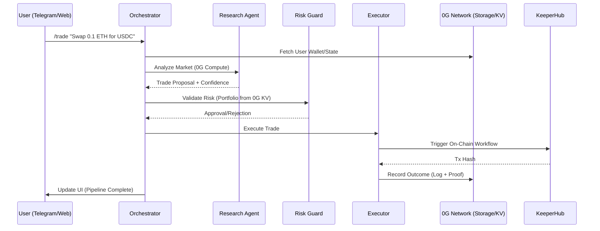

# 🪐 Axiom-Fi: The Autonomous Agentic Trading Terminal

```text
      ___       ___           ___           ___           ___           ___           ___     
     /  /\     /  /\         /__/\         /  /\         /  /\         /  /\         /__/\    
    /  /::\   /  /::\        \  \:\       /  /::\       /  /::\       /  /::\        \  \:\   
   /  /:/\:\ /  /:/\:\        \  \:\     /  /:/\:\     /  /:/\:\     /  /:/\:\        \  \:\  
  /  /:/~/://  /:/~/::\   _____\__\:\   /  /:/  \:\   /  /:/  \:\   /  /:/~/::\   _____\__\:\ 
 /__/:/ /://__/:/ /:/\:\ /__/::::::::\ /__/:/ \__\:\ /__/:/ \__\:\ /__/:/ /:/\:\ /__/::::::::\
 \  \:\/:/ \  \:\/:/__\/ \  \:\~~~~~~\ \  \:\ /  /:/ \  \:\ /  /:/ \  \:\/:/__\/ \  \:\~~~~~~\
  \  \::/   \  \::/       \  \:\        \  \:\  /:/   \  \:\  /:/   \  \::/       \  \:\      
   \  \:\    \  \:\        \  \:\        \  \:\/:/     \  \:\/:/     \  \:\        \  \:\     
    \  \:\    \  \:\        \  \:\        \  \::/       \  \::/       \  \:\        \  \:\    
     \__\/     \__\/         \__\/         \__\/         \__\/         \__\/         \__\/    
                                                                                            
                 DECENTRALIZED AGENTIC INTELLIGENCE · POWERED BY 0G NETWORK
```

Axiom-Fi is a state-of-the-art, **100% decentralized trading terminal** that orchestrates a pipeline of specialized AI agents to automate complex DeFi strategies. Built for the **0G Network Hackathon**, it leverages **0G Storage**, **0G KV**, and **0G Compute** to ensure every decision is verifiable, immutable, and performant.

---

## 💡 The Core Idea: The "Agentic Pipeline"

Traditional trading bots are "black boxes." You send money, and hope it works. **Axiom-Fi** breaks this paradigm by splitting the trading process into a verifiable, multi-agent pipeline where agents **pay each other** for work and **prove their decisions** on-chain.

### The Pipeline Architecture:

1.  **🔍 Research Agent**: Analyzes live market data (Uniswap V3 pools, sentiment, volatility) and generates a structured trade proposal.
2.  **🛡️ Risk Guard Agent**: Validates the proposal against the user's historical portfolio and global risk parameters stored in **0G KV**.
3.  **⚡ Executor Agent**: Converts the approved proposal into an on-chain workflow using **KeeperHub** and monitors the settlement.
4.  **🪙 Orchestrator**: The "Glue" that manages state transitions, triggers **x402 Micropayments**, and anchors the entire audit trail to **0G Storage**.

---

## 🔄 The Flow of Intelligence

### Sequence Diagram



---

## 🛠️ Visualizing the Pipeline

### How it works (ASCII Art representation)

**1. Data Ingestion & Analysis**
```text
[ Market Data ] ---> [ Research Agent ] ---> [ 0G Storage ]
      (ETH/USDC)       (LLM + Indicators)     (Immutable Audit)
```

**2. Risk Validation**
```text
[ Proposal ] + [ Portfolio State (0G KV) ] ---> [ Risk Guard ] ---> [ APPROVAL ]
```

**3. Execution & Settlement**
```text
[ Approved ] ---> [ Executor ] ---> [ KeeperHub ] ---> [ Base Sepolia ]
                                     (Automation)       (Uniswap V3)
```

---

## 🚀 Getting Started

### 1. Prerequisites
- **Node.js**: v18.x or higher
- **Wallet**: A wallet funded with **Base Sepolia ETH** and **A0GI** (0G Testnet Tokens).
- **Telegram Bot**: Obtain a token from [@BotFather](https://t.me/botfather).

### 2. Environment Setup
Create a `.env` file in the root directory:
```env
# Network
RPC_URL=https://sepolia.base.org
OG_EVM_RPC=https://evmrpc-testnet.0g.ai

# 0G Infrastructure
OG_INDEXER_URL=https://indexer-storage-testnet-turbo.0g.ai
OG_KV_URL=https://indexer-storage-testnet-turbo.0g.ai
OG_STORAGE_URL=https://storage-testnet.0g.ai
OG_FLOW_CONTRACT=0x22E03a6A89B950F1c82ec5e74F8eCa321a105296

# Keys
DEPLOYER_PRIVATE_KEY=your_private_key
TELEGRAM_BOT_TOKEN=your_bot_token
KEEPER_HUB_API_KEY=your_api_key
```

### 3. Installation & Launch
```bash
# Install root & agent dependencies
npm install

# Run the Telegram Bot (Forced Polling Mode)
npm run bot
```

---

## 📱 Using the App

### Via Telegram (@AxiomFiTrading_bot)
The Telegram bot is your primary interface for the autonomous pipeline.

-   **/start**: Initialize the bot and receive your unique agent identity.
-   **/wallet <address>**: Register your Base Sepolia wallet. This mapping is stored securely in **0G KV**.
-   **/trade <strategy>**: Trigger the agentic pipeline.
    - *Example*: `/trade Execute a minimal swap of 0.001 ETH to USDC if the Research agent sees stable market conditions.`
-   **/status**: Check the current health of the 0G Network nodes and your agent reputation.

### Via Web Terminal
Navigate to the hosted frontend (or `localhost:3000`) to view:
-   **Live Audit Trail**: Every log line streamed from the agents.
-   **0G Explorer Links**: Direct links to the 0G Chain Scan for every stored proof.
-   **Reputation Scoreboard**: See which agents are performing best based on accuracy and tier.

---

## 🛡️ Trust & Verification
Axiom-Fi is built on the principle of **"Don't Trust, Verify."** 
- Every decision made by an agent is signed and stored in **0G Storage**.
- You can verify any trade by clicking the **"Full Analysis"** button in Telegram, which pulls the raw logs directly from the decentralized storage network.

---

## 📜 License
Built with ❤️ for the 0G Network Hackathon. MIT License.
