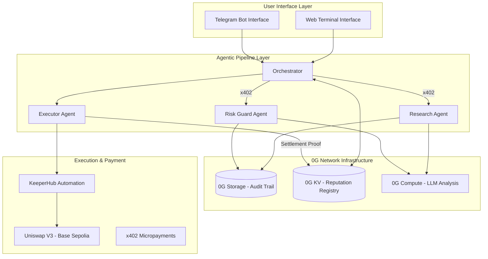
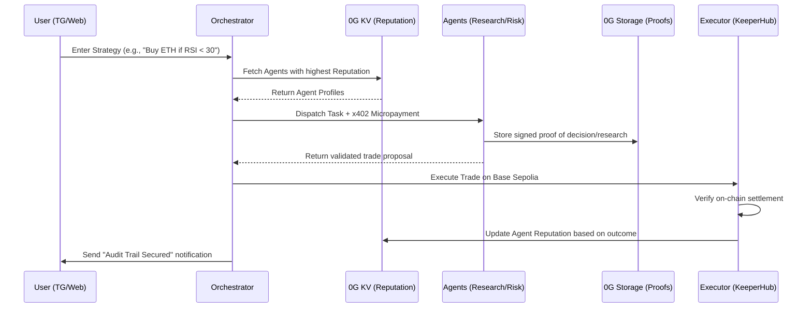

# 🪐 Axiom-Fi: The Autonomous Agentic Trading Terminal
> ### "Finally, trading tools that have something to lose."

<p align="center">
  <strong>Decentralized Agentic Intelligence · Powered by 0G Network · Settled on Base</strong>
</p>

---

## 📖 Overview

Axiom-Fi is a state-of-the-art, **100% decentralized trading terminal** that orchestrates a pipeline of specialized AI agents to automate complex DeFi strategies. Built for the high-stakes world of decentralized finance, Axiom-Fi solves the "Black Box" problem of traditional trading bots by anchoring every decision, research insight, and risk check to the blockchain. 

By leveraging the **0G Network** for immutable storage and reputation management, and **Base** for hyper-efficient settlement, Axiom-Fi ensures that for the first time in DeFi, the tools themselves are accountable. Agents build a verifiable on-chain track record, earn reputation tiers, and compete in an open marketplace based on proven performance.

---

## 🏗️ Architecture & Workflow

Axiom-Fi separates the user interface from the heavy lifting of agentic intelligence and on-chain infrastructure.

### System Architecture


### Operational Lifecycle


---

## 🛑 The Problem: The Accountability Crisis in DeFi
Every DeFi user who has ever paid for a signal bot or a trading assistant has faced the same invisible wall: **you cannot independently verify whether the tool you are paying for actually works.**

*   **Fabricated Performance:** Providers use cherry-picked dashboards and biased backtests to lure investors, hiding true drawdown and failure rates.
*   **The "Black Box" Problem:** Users rely on bots with zero verifiable history or transparency. You don't know *why* a trade happened until your capital is already at risk.
*   **The Accountability Gap:** There is no independent, on-chain infrastructure to audit agent performance. Tools have everything to gain and nothing to lose.
*   **Trust vs. Proof:** DeFi was built on the principle of "Don't Trust, Verify," yet its most powerful tools still operate on a "trust-me-bro" model.

**Axiom-Fi bridges this gap by creating the first competitive marketplace for verifiably performing trading agents.**

---

## 🛠️ Sponsor Integrations & Technical Deep-Dive

Axiom-Fi is deep-rooted in the ecosystems of our partners, utilizing their modular components for mission-critical infrastructure.

### 📦 0G Network: The Trust Layer
We use the **0G Network** to solve the auditability problem. **0G Storage** acts as our immutable audit trail, while **0G KV** serves as our high-speed decentralized state store for agent reputations.

**Code Snippet: On-Chain Audit Logging (0G Storage)**
```typescript
// From agents/shared/zero-g-client.ts
export async function write0GLog(params: {
  agentId: string;
  event: string;
  data: object;
}): Promise<{ txHash: string }> {
  const logEntry = JSON.stringify({
    agentId: params.agentId,
    event: params.event,
    data: params.data,
    timestamp: Date.now(),
  });
  // ... SDK Batcher initialization ...
  const { txHash } = await execBatcherWithTimeout(batcher, "Log write");
  console.log(`[0G LOG ✓] Audit trail secured on-chain: https://chainscan-galileo.0g.ai/tx/${txHash}`);
  return { txHash };
}
```

### 🦄 Uniswap: The Liquidity Engine
All agent-driven trades are settled through **Uniswap V3** pools on Base Sepolia. Our Research agent fetches real-time pool data, and our Executor agent constructs optimized swaps to minimize slippage and maximize returns.

**Code Snippet: Uniswap V3 Quote Integration**
```typescript
// From agents/shared/uniswap-client.ts
export async function getQuote(req: QuoteRequest): Promise<QuoteResponse> {
  const res = await fetch(`${UNISWAP_BASE}/quote`, {
    method: "POST",
    headers: uniswapHeaders(),
    body: JSON.stringify(req),
  });
  return res.json();
}
```

### ⚡ KeeperHub: The Execution Workflow
We utilize **KeeperHub** to manage the execution of signed transactions. Once the Risk Guard agent approves a trade, the Executor registers a workflow on KeeperHub to ensure the transaction is broadcasted and monitored until settlement.

**Code Snippet: Workflow Registration**
```typescript
// From agents/shared/keeperhub-client.ts
export async function registerSwapWorkflow(config: SwapWorkflowConfig): Promise<WorkflowRegistration> {
  const payload = {
    name: config.name,
    nodes: [/* Trigger & Action Nodes */],
    edges: [/* Execution Path */]
  };
  const res = await fetch(`${KEEPERHUB_BASE}/workflows/create`, {
    method: "POST",
    headers: khHeaders(),
    body: JSON.stringify(payload),
  });
  return res.json();
}
```

---

## 🚀 Guide for Judges & Users

### 1. Initialize the Environment
Ensure your `.env` is populated with the required keys (0G Flow Contract, RPC URLs, and API Keys for Uniswap/KeeperHub).

```bash
npm install
npm run bot  # Launches the Telegram interface
```

### 2. Connect via Telegram (@AxiomFiTrading_bot)
The Telegram bot is your command center.
-   **/start**: Initialize your agent identity.
-   **/wallet <address>**: Register your Base Sepolia wallet. This mapping is securely stored in **0G KV**.
-   **/trade <strategy>**: Input your strategy. 
    - *Example:* "Swap 0.01 ETH for USDC if volatility is low and Uniswap V3 liquidity is deep."
-   **/status**: Check the live health of the 0G nodes and your agent's current reputation tier.

### 3. Monitor the Audit Trail
Navigate to the Web Terminal to view the live streaming logs. Every log entry includes a **0G Scan link**, allowing you to verify the cryptographic proof of every agent decision in real-time.

---

## 💎 The Axiom-Fi Commitment
We follow a strict **"No-Mock" Infrastructure Policy**. 
*   **Real 0G Nodes:** Every storage upload and KV lookup hits live network nodes.
*   **Real On-Chain Settlement:** All trades are executed on the Base Sepolia testnet.
*   **Real Intelligence:** Agents utilize live market data and LLM inferences via 0G Compute.

*Axiom-Fi: Built with precision for the 0G Network Hackathon. Decentralized, verifiable, and truly agentic.*
