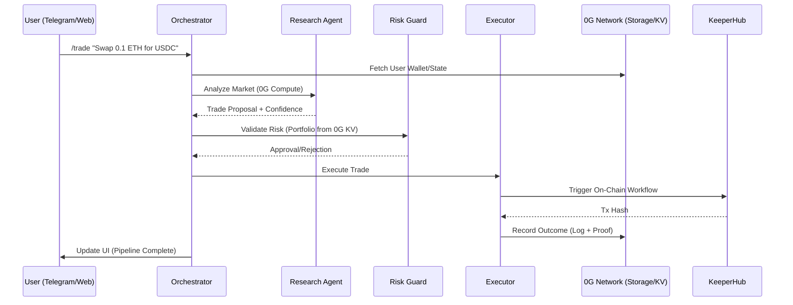

# 🪐 Axiom-Fi: The Autonomous Agentic Trading Terminal

<p align="center">
  
</p>

<p align="center">
  <strong>Decentralized Agentic Intelligence · Powered by 0G Network</strong>
</p>

<p align="center">
  <a href="#-the-agentic-pipeline">Architecture</a> •
  <a href="#-0g-infrastructure-integration">0G Integration</a> •
  <a href="#-getting-started">Getting Started</a> •
  <a href="#-trust--verification">Auditability</a>
</p>

---

Axiom-Fi is a state-of-the-art, **100% decentralized trading terminal** that orchestrates a pipeline of specialized AI agents to automate complex DeFi strategies. Built for the **0G Network Hackathon**, it leverages **0G Storage**, **0G KV**, and **0G Compute** to ensure every decision is verifiable, immutable, and performant.

## 💡 The Core Idea: The "Agentic Pipeline"

Traditional trading bots are "black boxes." You send money, and hope it works. **Axiom-Fi** breaks this paradigm by splitting the trading process into a verifiable, multi-agent pipeline where agents **prove their decisions** on-chain.

### The Pipeline Architecture

1.  **🔍 Research Agent**: Analyzes live market data (Uniswap V3 pools, sentiment, volatility) and generates a structured trade proposal.
2.  **🛡️ Risk Guard Agent**: Validates the proposal against the user's historical portfolio and global risk parameters stored in **0G KV**.
3.  **⚡ Executor Agent**: Converts the approved proposal into an on-chain workflow using **KeeperHub** and monitors the settlement.
4.  **🪙 Orchestrator**: The "Glue" that manages state transitions, triggers **x402 Micropayments**, and anchors the entire audit trail to **0G Storage**.

---

## 🛠️ 0G Infrastructure Integration

Axiom-Fi is deep-rooted in the 0G ecosystem, utilizing its modular components for critical infrastructure:

-   **📦 0G Storage**: Used for the **Immutable Audit Trail**. Every agent log, decision rationale, and transaction proof is uploaded to 0G Storage. This ensures that users can verify why a trade happened, even years later.
-   **🔑 0G KV**: Acts as the **Decentralized State Store**. We store user preferences, wallet mappings, and "Agent Reputation" scores in 0G KV for sub-second lookup and decentralized persistence.
-   **🖥️ 0G Compute**: Powers the **Agent Intelligence**. Our agents run on 0G-optimized serving infrastructure, ensuring that high-performance LLMs (like Qwen-2.5) are accessible for real-time market analysis.

---

## 🔄 The Flow of Intelligence



---

## 🚀 Getting Started

### 1. Prerequisites
- **Node.js**: v18.x or higher
- **Wallet**: A wallet funded with **Base Sepolia ETH** and **A0GI** (0G Testnet Tokens).
- **Telegram Bot**: Obtain a token from [@BotFather](https://t.me/botfather).

### 2. Environment Setup
Create a `.env` file in the root directory:

```env
# Network
RPC_URL=https://sepolia.base.org
OG_EVM_RPC=https://evmrpc-testnet.0g.ai

# 0G Infrastructure
OG_INDEXER_URL=https://indexer-storage-testnet-turbo.0g.ai
OG_KV_URL=https://indexer-storage-testnet-turbo.0g.ai
OG_STORAGE_URL=https://storage-testnet.0g.ai
OG_FLOW_CONTRACT=0x22E03a6A89B950F1c82ec5e74F8eCa321a105296

# Keys
DEPLOYER_PRIVATE_KEY=your_private_key
TELEGRAM_BOT_TOKEN=your_bot_token
KEEPER_HUB_API_KEY=your_api_key
```

### 3. Installation & Launch
```bash
# Install root & agent dependencies
npm install

# Run the Telegram Bot (Forced Polling Mode)
npm run bot
```

---

## 📱 Using the App

### Via Telegram (@AxiomFiTrading_bot)
The Telegram bot is your primary interface for the autonomous pipeline.

-   **/start**: Initialize the bot and receive your unique agent identity.
-   **/wallet <address>**: Register your Base Sepolia wallet. This mapping is stored securely in **0G KV**.
-   **/trade <strategy>**: Trigger the agentic pipeline.
    - *Example*: `/trade Execute a minimal swap of 0.001 ETH to USDC if the Research agent sees stable market conditions.`
-   **/status**: Check the current health of the 0G Network nodes and your agent reputation.

### Via Web Terminal
Navigate to the hosted frontend to view:
-   **Live Audit Trail**: Every log line streamed from the agents.
-   **0G Explorer Links**: Direct links to the 0G Chain Scan for every stored proof.
-   **Reputation Scoreboard**: See which agents are performing best based on accuracy and tier.

---

## 🛡️ Trust & Verification

Axiom-Fi is built on the principle of **"Don't Trust, Verify."** 
- **Proof of Decision**: Every recommendation from the Research agent includes a cryptographic proof stored on 0G.
- **Deterministic Risk**: The Risk Guard uses static rules and real-time state from 0G KV, ensuring no "hallucinated" approvals.
- **On-Chain Audit**: Click the **"Full Analysis"** button in Telegram to pull the raw logs directly from the 0G Storage network.

---

## 🏗️ Technical Stack

- **Frontend**: Next.js 15+, Tailwind CSS 4.0, Framer Motion
- **Agents**: TypeScript, 0G Serving SDK, GrammY (Telegram)
- **Infrastructure**: 0G Network (Storage, KV, Compute)
- **DeFi**: Uniswap V3, KeeperHub Automation
- **Payments**: x402 Micropayments Protocol

---

## 💎 The Axiom Commitment: No-Mocks

In a world of "demo-ware," Axiom-Fi stands apart. Our codebase follows a strict **No-Mock Policy**:
- **Real 0G Nodes**: Every storage upload and KV lookup hits the live 0G testnet.
- **On-Chain Settlement**: All trades are executed via real smart contracts on Base Sepolia.
- **Live Intelligence**: Agents utilize real-time market data and LLM inferences, not hardcoded scripts.

*If the infrastructure is down, the system fails transparently. We don't hide behind mock data.*

---

## 📜 License
Built with ❤️ for the 0G Network Hackathon. MIT License.
